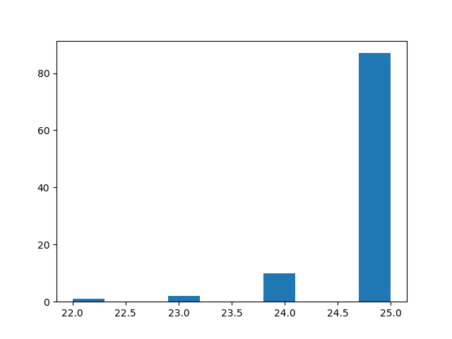

# Some results

## AI Cheater

The article has 24.87 for Cheating.

* With git-82e53b7,
Cheater has an average score of 24.127 on 1000 games.

* With git-fa5f8b9, avg score is 24.443

* With git-c29a1b4, avg score is 24.746, 24.810

## My SuperAI1

### Description

This AI implements the following logic: (...)
[5-10 lines description, some figures]

### Scores
* With git-123456 (May 7th), it achieves the following score:

  (either some figures or tables, whichever is most explicit)

  

### Discussion
  Here you may want to comment those scores (is it good, bad, why it fails on a specific game, ...)

## My SuperAI2

* With git-456789 (May 14th), we've improved SuperAI1 with such and such idea
